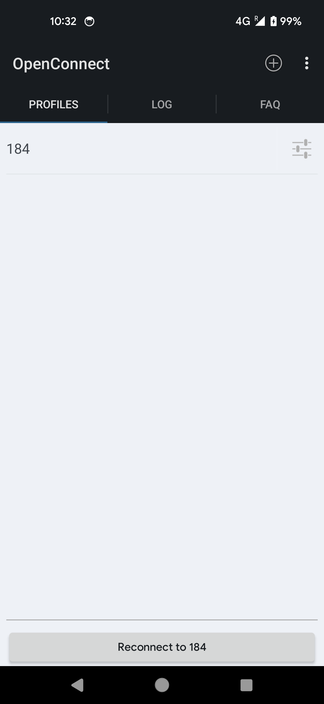
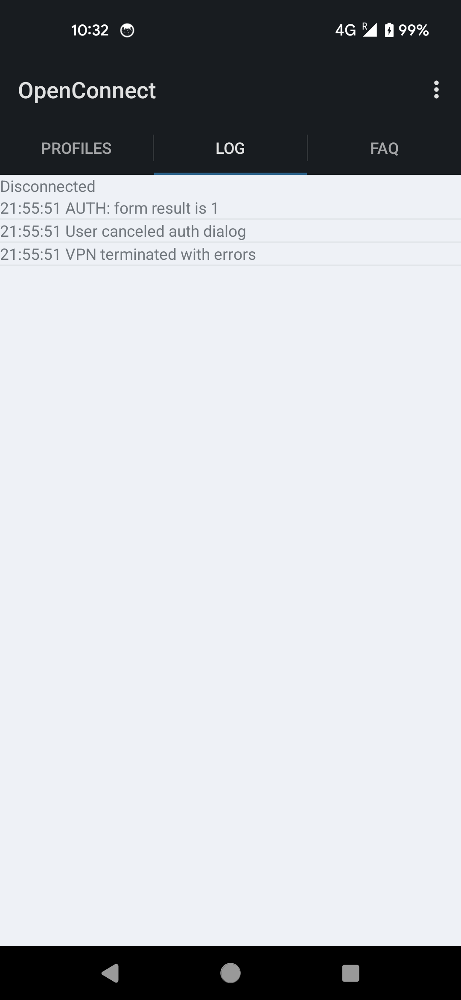
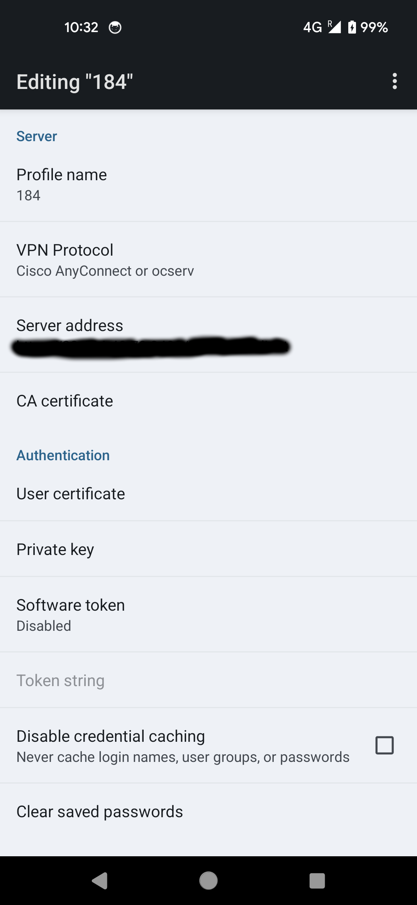
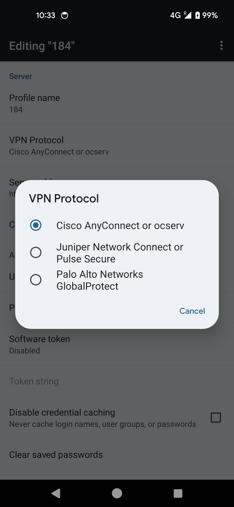

Current status: cannot type username and password on connect, but other bugs has been fixed.
-------

# OpenConnect for Android


This is a VPN client for Android, based on the Linux build of [OpenConnect](http://www.infradead.org/openconnect/). Available for Arm and Arm64 platform.

Much of the Java code was derived from [OpenVPN for Android](https://play.google.com/store/apps/details?id=de.blinkt.openvpn&hl=en) by Arne Schwabe.

OpenConnect for Android is released under the GPLv2 license. For more information, see the [COPYING](COPYING) and [doc/LICENSE.txt](doc/LICENSE.txt) files.

Changelog: see [doc/CHANGES.txt](doc/CHANGES.txt)

To help out with translations, please visit [this project's page on Transifex](https://www.transifex.com/projects/p/ics-openconnect/).

## Downloads and Support

You can build the package and install it on your phone. There are no openconnect packages in any Android store released by this project.

## Screenshots

&nbsp;


&nbsp;


## Building from Source

### Prerequisites

On the host system, you'll need to install the following:

- **Android SDK**: Ensure `platform-tools/` and `tools/` directories are added to your `$PATH`.
- **ANDROID_HOME**: Set `$ANDROID_HOME` to point to your Android SDK directory.
- **Java Development Kit (JDK)**: Install `javac 17` or later and make sure it's in your `$PATH`.
- **Apache Ant**: Install a recent version of Apache Ant and add it to your `$PATH`.
- **Android SDK Manager**: Use it to install API Level 23.
- **NDK r25c**: Unzip this under `/opt/android-sdk-linux_x86/` or any preferred directory.
- **Development Tools**: Install `gcc`, `make`, and other necessary tools (e.g., Red Hat "Development Tools" or Debian's `build-essential` package).
- **Version Control and Build Tools**: Install `git`, `autoconf`, `automake`, and `libtool`.

If you use Ubuntu, just need follow this repository UBUNTU.md

### Compiling the External Dependencies

Building OpenConnect from source requires compiling several `.jar` files and native binaries from external packages. These commands will build the binary components and copy them into the appropriate library and asset directories:

```bash
git clone https://github.com/mkevinstever/openconnect-android
cd openconnect-android
git submodule init
git submodule update
make -C external
```

This procedure only runs on a Linux PC. If you are unable to build from source, you can try fetching the cached artifacts from a recent CI build:

```
./misc/download-artifacts.sh
```

Compiling the App
After the binary components are built, this compiles the Java sources into an APK file:

```
cd openconnect-android
./gradlew assembleDebug
```

To install the APK on a device:

```
adb install -r app/build/outputs/apk/debug/app-debug.apk
```

Logs of successful (and not-so-successful) builds can be found on this project's Travis CI page.
