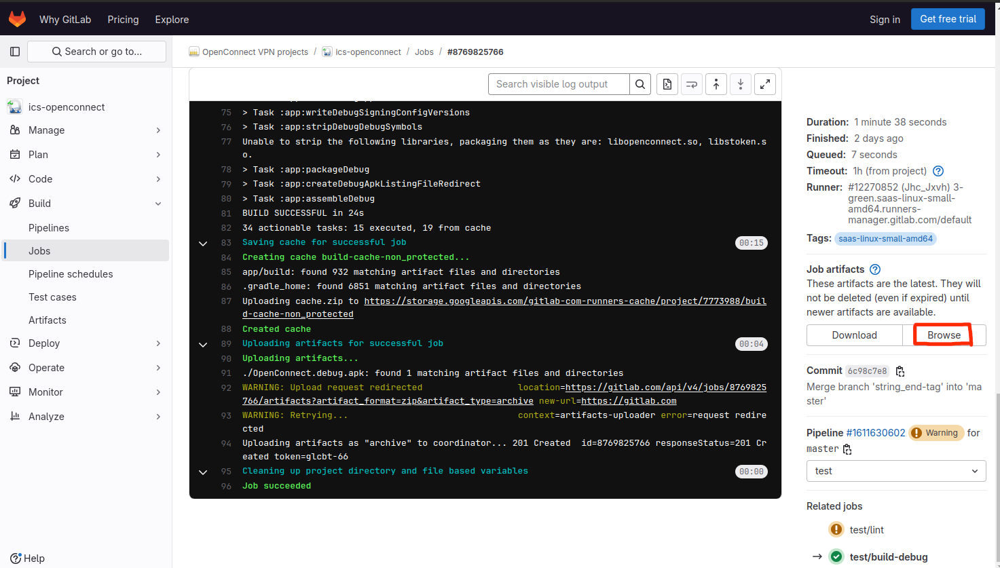

### How to download the latest version of Openconnect for Android APK file?

Multi Languages: [русский](./HTD_ru.md) | [中文简体](./HTD_zh.md) 

You can download the latest version of the Android app APK file with debug flag on https://gitlab.com/openconnect/ics-openconnect/-/jobs

1. Open this URL and find any job named test/build-debug with a status of passed.

2. Select a job and click

3.Find a title on page and named "Job artifacts", and click "Browse" button.

4.You will see debug version APK, click name.

5.Click download.

6.You will see downloaded file later.

