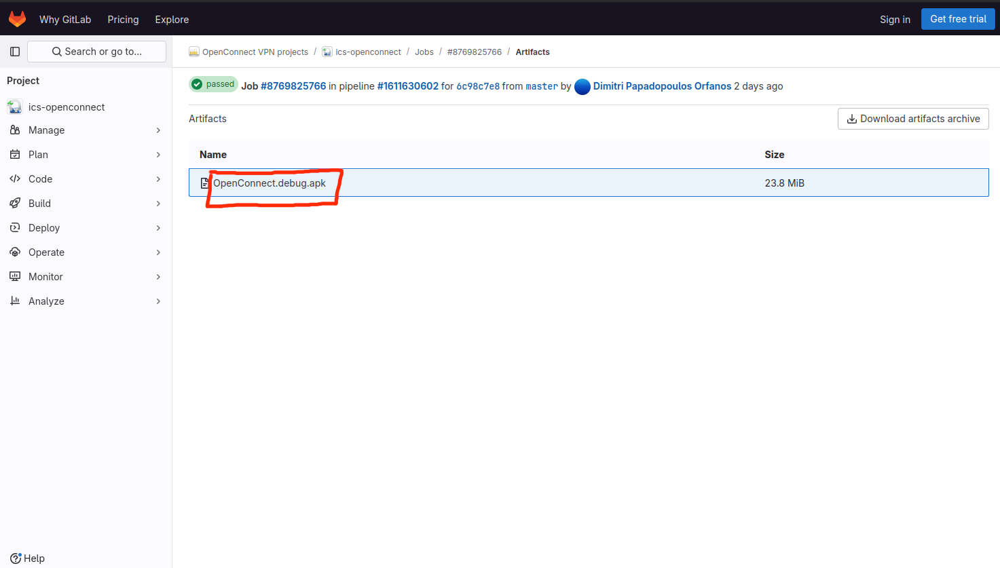
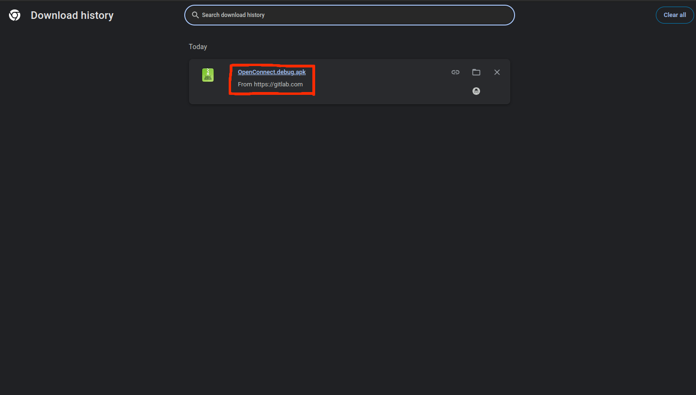

### How to download debug version APK file

You can download the latest version android app APK file with debug flag on https://gitlab.com/openconnect/ics-openconnect/-/jobs

1.Open this URL, find a any job named test/build-debug and state is success.

2.Select one job and click.

3.Find a title named "Job artifacts", and click "Browse" button.

4.You will see debug version APK, click name.

5.Click download.

6.You will see downloaded file.

