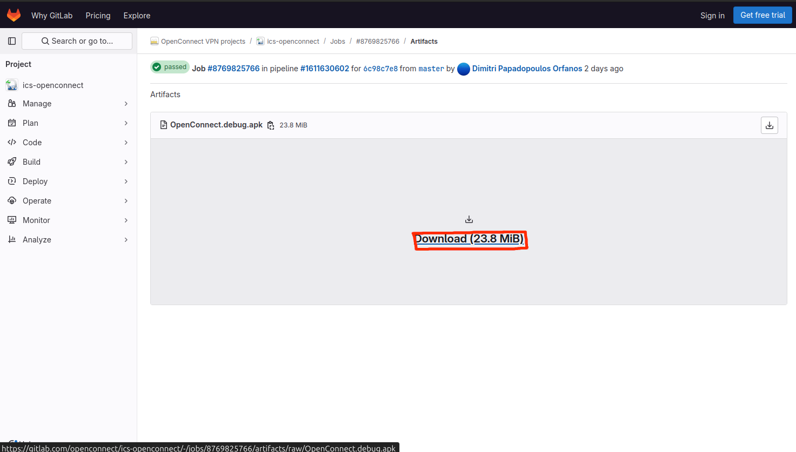

### Как загрузить последнюю версию Openconnect для Android APK-файла?

Вы можете загрузить последнюю версию APK-файла приложения Android с флагом отладки на https://gitlab.com/openconnect/ics-openconnect/-/jobs

1.Откройте этот URL-адрес и найдите любое задание с именем test/build-debug со статусом passed.

2.Выберите работу и нажмите

3.Найдите на странице заголовок «Job artifacts» и нажмите кнопку «Browse».

4.Вы увидите APK отладочной версии, нажмите на название.

5.Нажмите «Download».

6.Позже вы увидите загруженный файл.

