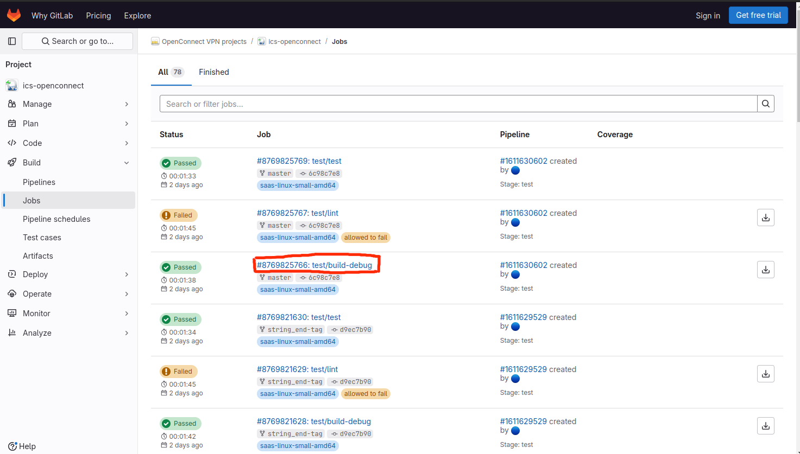
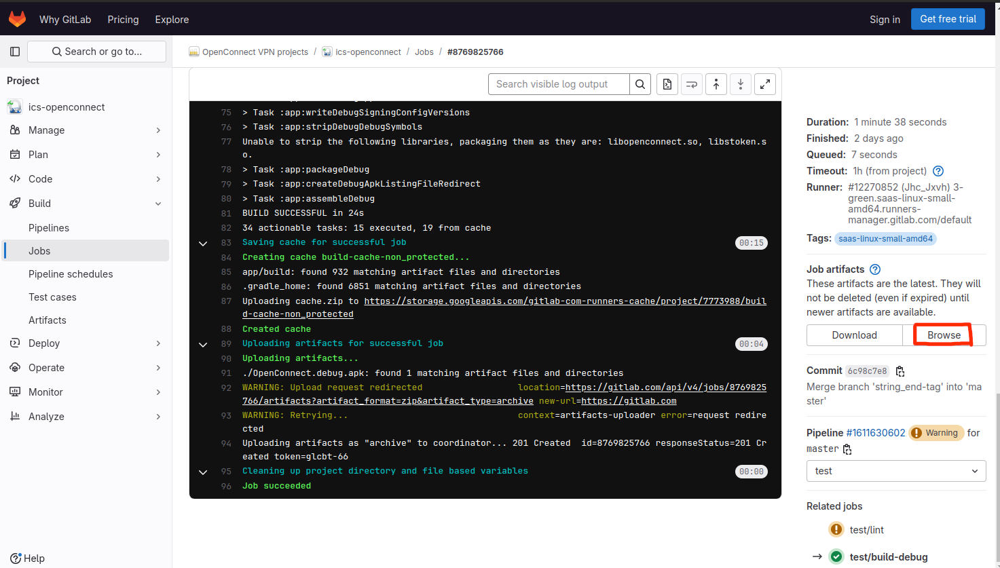
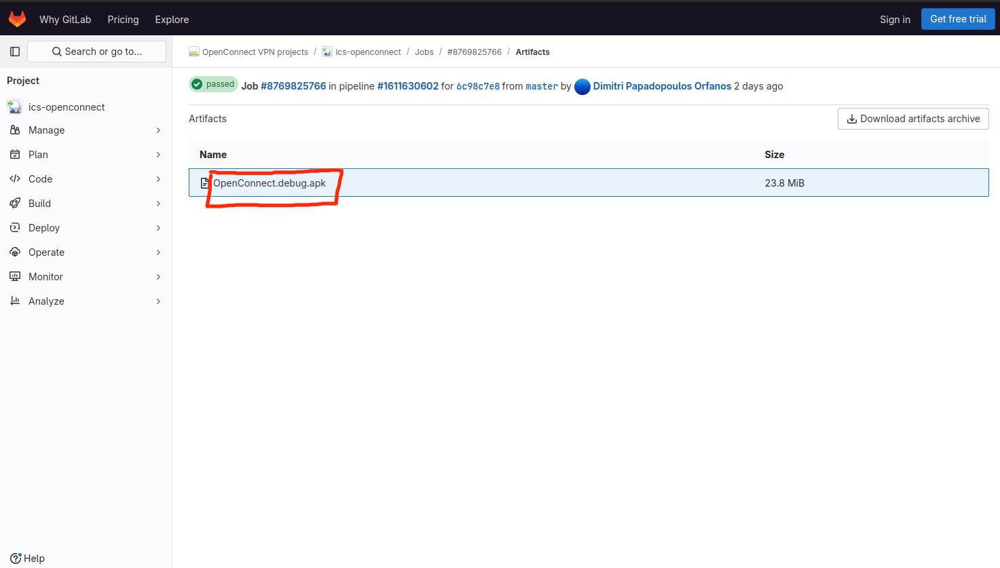
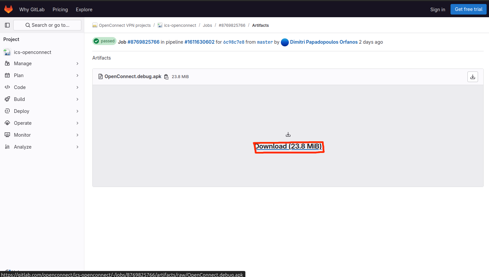
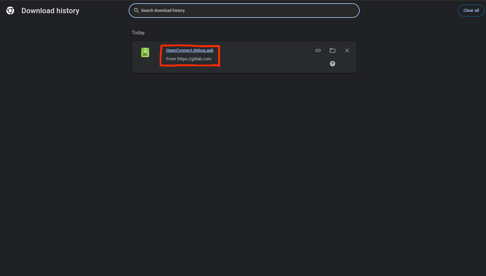

### 如何下载最新版本Openconnect Android APK文件

您可以在以下链接下载最新版本的APK版本文件（使用testkey签名的debug版本） https://gitlab.com/openconnect/ics-openconnect/-/jobs

1.打开这个链接, 找到任意一个近期名为 test/build-debug 的Job 并且 状态为Passed。

2.选择任意一个近期的Job，并点击进入。

3.在页面上找到一个名为 "Job artifacts" 的标题, 随后点击 "Browse" 按钮.

4.您将看到Debug版本的APK文件，此时单击一下它的名字。

5.单击 Download 按钮。

6.此时，您将能看到下载后的文件。

